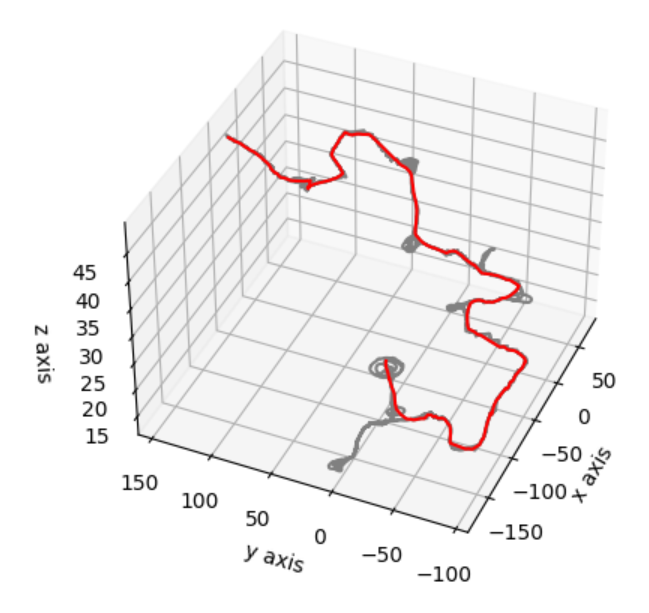
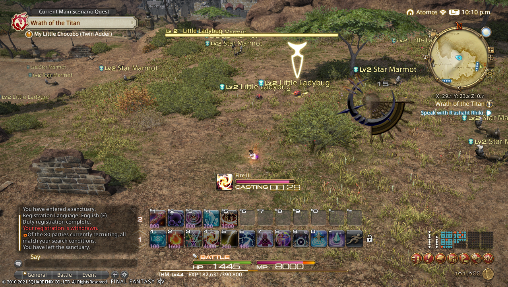
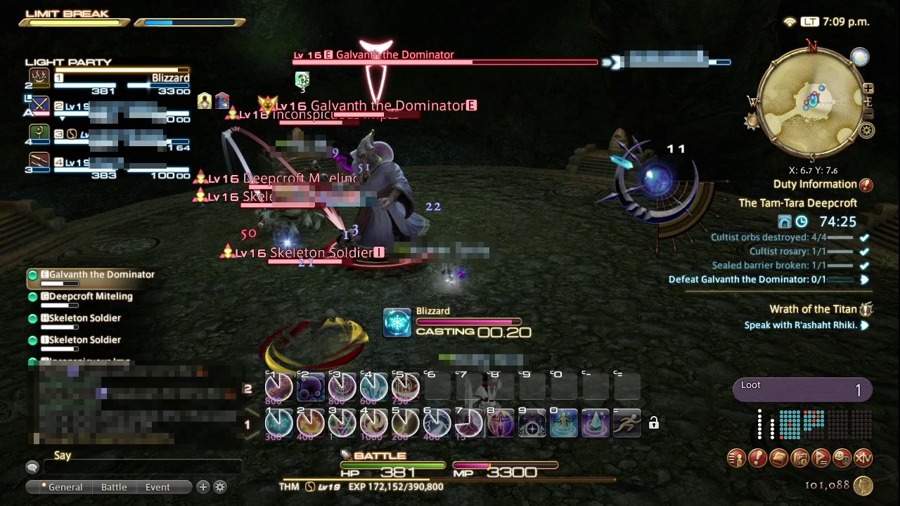

# FFXIV Syraxius Bot
Experimental bot for Final Fantasy XIV. Still largely WIP.

# Disclaimer:
- This software is for educational purposes only
- Hacking is illegal and it violates FFXIV's terms of use
- I am not responsible for any consequence resulting from the use of this software

# Installation (for Windows):
- Clone this repository (or download this repository and extract it somewhere)
- Install Python 3.9 from https://www.python.org/
- Create a Python 3.9 virtual environment in this folder using `python3 -m venv venv`
- Activate your virtual environment using `cd venv/Scripts && activate`
- Install requirements listed in requirements.txt using `pip install -r requirements.txt`
- (Personally, I just use PyCharm IDE for all these)

# Features

- Navigation engine
  - Human-like in-game character control
  - Waypoints recording, visualization and optimization
  - Combining of multiple waypoint recordings into a single optimized connected graph (adjacency list)
  - Shortest path routing for navigation (SSSP using Dijkstra's algorithm)
- Memory-reading engine
  - Obtain information like HP, MP, coordinates, map information, target information, and more directly from game engine.
- Combat automation engine
  - Assist
    - Memory-reading and state-machine based combat automation
    - Automatically chooses skills and combos based on current level (adapts to level sync too)
    - Black Mage automatic optimal fire / blizzard combo + buffs
    - (Other classes combo still WIP)
- Gameplay automation engine
  - Dungeon
    - Memory-reading and state-machine based gameplay automation
    - Progress through dungeon at the team's pace without running ahead
    - Human-like movement and fighting
    - Automatically engage only aggro'ed monsters
    - Automatically accept duty
    - Automatically skip cutscenes
- Others
  - Control game even when game is minimized

# Waypoints

## Record waypoints

Run `main_record.py` and walk around in-game.

When you stop it with CTRL+C, a recording<timestamp>.json will be created containing the waypoints.

## Visualize waypoints

The above shows a sample recording for Tam-Tara Deepcroft.

Modify `main_visualize.py` and point it to your recording file.

Specify the start and end coordinates for the shortest path routing (you can try using the first and end coordinates in your recording JSON file).

Run `main_visualize.py` to generate a visualization of your waypoints and the optimal route based on your start and end coordinates.

## Test waypoints in-game

Modify `main_walk.py` and point it to your recording file.

Specify the start and end coordinates for the shortest path routing (you can try using the first and end coordinates in your recording JSON file).

Run `main_walk.py` to walk your character between the waypoints nearest to the coordinates you specified.

# Getting Started

(Note that all modes also automatically dump a waypoint recording for use later)

## Combat automation

### Assist

Automates attack combos for your character, leaving you free to make other decisions.

Modify `main.py` and change `mode` to the following:
- `assist` - Automatically run attack combo only when you select a target and it is in range
- `assist_autotarget` - Automatically select nearest enemy and run attack combo when in range
- `assist_autoapproach` - Automatically approach your selected enemy and run attack combo when in range
- `assist_autotarget_autoapproach` - Automatically select nearest enemy, approach, and run attack combo when in range

Update the dictionary of `spells` accordingly (or move your own hotbar to match).

Run `main.py` and have fun!

## Gameplay automation

### Dungeon

Automates dungeon runs with human-like navigation and fighting.

Note: The `assist` modes above need to be working before trying out `dungeon` mode.

Modify `main.py` with the following changes:
- Change `mode` to `dungeon`
- Point to the right waypoint file (there are some samples in recordings folder, or record your own)
- Specify the correct end coordinate (when using your own recording, ensure that you test using visualize tool)

Run `main.py` and have fun!

# Additional tools

## Estimation tools

Running `main_estimate_turn_speed.py` will give you a list of <hold duration, delta radians> values for linear regression plotting.
- Current results show default keyboard turn speed to be `delta radians = 2.4 * hold duration + 0.055`

Running `main_estimate_walk_speed.py` will give you walking speed in yards/sec.
- Current results show default character speed to be `6 yards/sec`.
